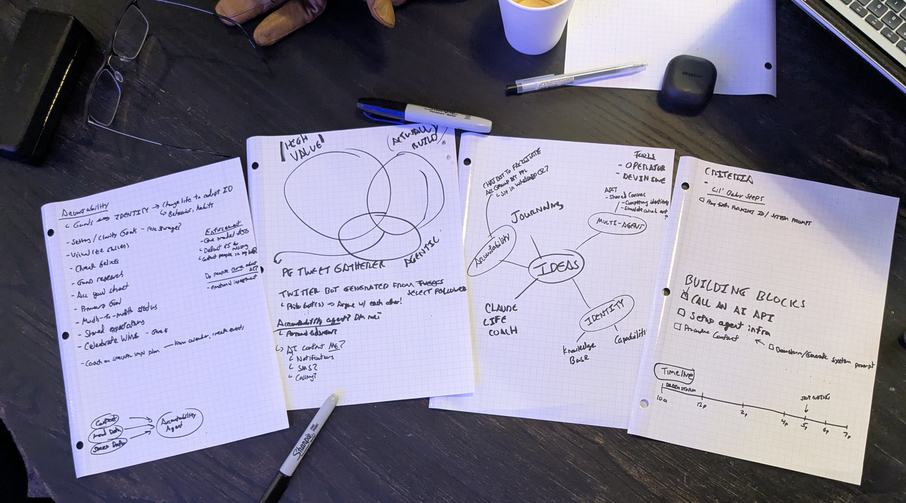

# betaworks_agentic_model_hackathon_jan_2025
Agentic model themed hackathon at betaworks.

## THE IDEA 
Accountability group are very effective at motivating people to acoomplish things in their lives that they would otherwise neglect. What if there was an agent that could work with someone to understand their goals and where they want to be held accountable, and then proactively reach out to the user on a daily/weekly basis to initiate a conversation on how they're doing? 

The identity portion here is creating the type of Agent the feels more *proactive* rather than reactive, which would distance it from a normal chatbot. Ideally we'd love to experiment with a personality that can ask intriguing questions to help a user work through their goals, identify pitfalls, and provide overall encouragement. Due to tiem constraints. Our MVP's accountability partner identity is Batman. Enjoy!

### Ideation

## Project Status by deadline
- Got working API calls to OpenAI 
- Got whatsapp messages sent to a specified number via Twilio 
- Got Agentstack to run locally to simulate agent behavior

While these pieces were individually setup, the actually process of building a cohesive agent that can reliably contact a user has not been built out.

# Tech / Tools 
- Setup Agents via [Agentstack](https://docs.agentstack.sh/introduction)
- UI tooling is configured via [AgentOps](https://app.agentops.ai/overview)
- Utilized OpenAI API GPT-4o for LLM processing
- Twilio for Whatsapp messaging for the user

# Setup instructions
- copy `.env.example` as `.env`, and enter relevant API keys 
    - AgentOps key can be created by making an account on the site above and starting a new project (free)
- Ensure python 3.12 is used locally
- run `cd agentstack_files`
- run `pipenv install && pipenv run agentstack run`
